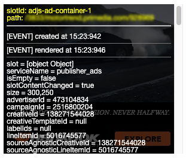
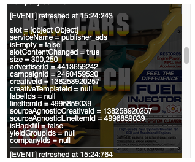
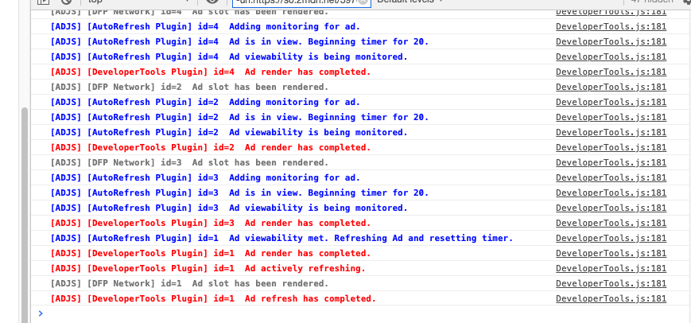

# Developer Tools

Debugging advertisements is notably non-trivial. One of the biggest benefits of using Ad.js is the `DeveloperTools` module.
When included in your `Page` or `Ad` you will see all pertinent information available for your ads both in the console and in ad overlays.



<br />


When creating a page or ad, you can choose to turn on one or both available features as ```overlay: boolean, logging: boolean``` 

Both of which default to true when the plugin is included.

# Note

The `DeveloperTools` is a development environment feature. If you include this module in your production environment, you will be informed via the console that in order to view logs or ad overlays, you must simply call `AdJS.DEBUG()` and Ad.js will enable your developer tools.